# Pokédex — Mobile Take-Home Test

Aplikasi Pokédex React Native (Android & iOS) yang mengambil data dari [PokéAPI](https://pokeapi.co/docs/v2).
Jelajahi 1.025 Pokémon nasional, cari berdasarkan nama atau nomor, saring per tipe dan generasi,
pelajari stat, move, lokasi, evolusi, dan kelemahannya, lalu simpan favorit — tetap bisa dibuka saat offline.
Tab **Jelajah** (v2) membuka hampir seluruh data PokéAPI lainnya: move, item, berry, region & lokasi,
game, Pokédex regional, kelompok Pokémon, nature, growth rate, kontes, pemicu evolusi, dan metode encounter.

**Desain (pen.dev):** <https://app.pen.dev/s/pxSZIunWq7kzaxJQAu8UZFhh2eDGY_vDyWLisMg31tA>
— file sumbernya ada di [`design/pokedex.pen`](design/pokedex.pen).

<!-- apk-download -->
<a href="https://github.com/riantosm/pokedex-app/raw/main/pokedex-app/documentation/PokedexApp-v0.2.0%282%29-release.apk"></a>
<!-- /apk-download -->

APK Android (arm64-v8a & armeabi-v7a, Android 7.0+) — unduh, lalu izinkan *Instal aplikasi tidak dikenal*
saat diminta. File-nya juga ada di [`pokedex-app/documentation/`](pokedex-app/documentation/).

<p>
  
  
  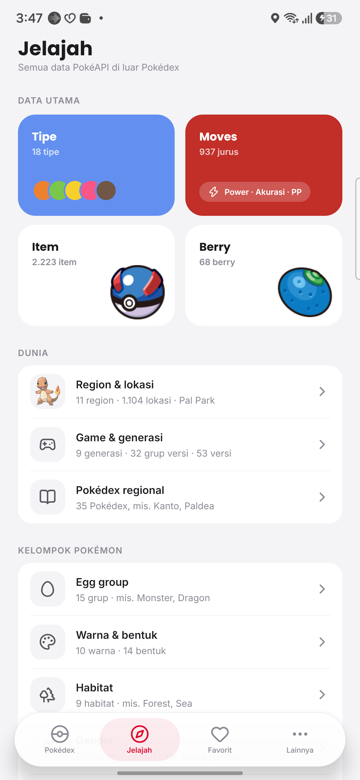
  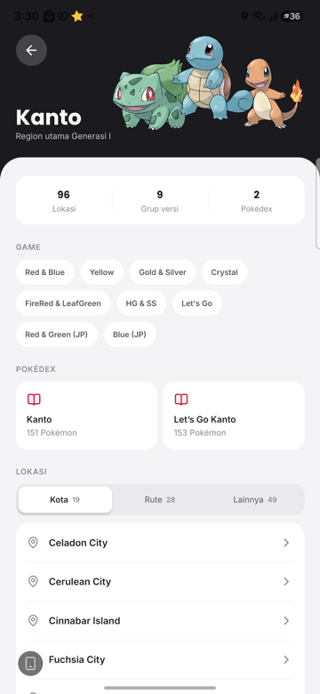
</p>

---

## Daftar isi

- [Fitur](#fitur)
- [Desain](#desain)
- [Screenshot](#screenshot)
- [Menjalankan project](#menjalankan-project)
- [Struktur repo](#struktur-repo)
- [Arsitektur](#arsitektur)
- [Keputusan teknis](#keputusan-teknis)
- [Performa](#performa)
- [Mode offline](#mode-offline)
- [Ukuran APK](#ukuran-apk)
- [Pengujian](#pengujian)
- [Keterbatasan & langkah berikutnya](#keterbatasan--langkah-berikutnya)
- [Kredit](#kredit)

## Fitur

| Halaman | Isi |
|---|---|
| **Pokédex** | Grid 1.025 Pokémon berwarna sesuai tipe, dimuat 20 per halaman saat digulir. Cari nama (sebagian) atau nomor (persis), chip filter 18 tipe, sheet urutkan (nomor / nama) + filter generasi I–IX. |
| **Detail Pokémon** | Hero berwarna tipe dengan parallax dan 6 tab: **About** (deskripsi, tinggi/berat, ability, gender, link ke egg group / habitat / warna / bentuk / growth rate, nomor di tiap Pokédex regional), **Stats** (6 base stat + total; tap stat → sheet nature naik/turun, move penaik, karakteristik IV), **Moves** (pilih game, segmen Level / TM / Telur / Tutor), **Evolusi** (rantai + syarat), **Lokasi** (area per game: metode, level, kondisi, peluang), **Lemah** (×4 / ×2 / ×½ / ×¼ / ×0). Tombol sebelum/berikutnya, favorit, sheet ability. |
| **Jelajah** (v2) | Hub semua data di luar Pokédex, dengan jumlah tiap resource. |
| **Tipe** | 18 tipe dengan jumlah Pokémon dan artwork perwakilan; detail tipe berisi efektivitas menyerang & bertahan serta daftar Pokémon-nya. |
| **Moves** | 937 move: cari, filter Fisik / Khusus / Status dan tipe. Detail: power/akurasi/PP/prioritas, efek, target, TM per game, kontes, Pokémon yang mempelajari. |
| **Item & Berry** | 2.223 item per kantong (harga, atribut, efek Fling, pemegang liar) dan 68 berry (5 rasa ↔ kategori kontes, data tanam, Natural Gift). |
| **Region & lokasi** | 11 region (game, Pokédex, lokasi kota/rute/lainnya), detail lokasi dengan Pokémon liar per versi beserta level & peluang, dan Pal Park (skor Catching Show). |
| **Game & Pokédex** | 9 generasi beserta grup versinya; Pokédex regional dalam grid. |
| **Kelompok Pokémon** | Egg group, warna, bentuk, habitat, dan gender (sebaran rasio jantan/betina 1.025 spesies). |
| **Referensi** | Nature (stat ▲▼, rasa, Pokéathlon, gaya bertarung), growth rate (rumus, grafik EXP, contoh), kontes, pemicu evolusi (+ variabel tersembunyi), metode & kondisi encounter. |
| **Favorit** | Pokémon yang disimpan di perangkat; tersedia offline. |
| **Lainnya** | **Bahasa data** (14 bahasa PokéAPI untuk nama & deskripsi, dengan contoh langsung; bahasa tak resmi ditandai), ukuran data tersimpan, hapus cache, versi app, **versi data PokéAPI** (tanggal rilis data), sumber data, disclaimer. |

Berlaku di semua halaman:

- **Pull-to-refresh** untuk memuat ulang data dari API.
- **State lengkap**: skeleton saat memuat, hasil kosong, error / offline dengan tombol coba lagi.
- **Animasi**: transisi halaman geser, kartu muncul saat digulir, isi tab memudar, top bar yang
  muncul saat hero tergulir, efek tekan pada semua elemen yang bisa ditap.
- **Tab bar melayang** yang tidak pernah menutupi konten terakhir dan otomatis tersembunyi saat keyboard muncul.
- **Mode offline**: penanda *Offline · menampilkan data tersimpan*, semua data yang pernah dibuka
  (disimpan ke disk 7 hari) dan gambarnya tetap tampil, lalu data dimuat ulang otomatis saat koneksi kembali.
- **Scroll mulus** meski grid penuh gambar (lihat [Performa](#performa)).
- **Ikon aplikasi Pikachu** (adaptive & themed icon Android 13+, set AppIcon iOS).

## Desain

Semua layar didesain dulu di pen.dev, lalu diimplementasikan mengikuti token & komponen yang sama
(tema *Classic Red*, Poppins + Inter, warna kartu per tipe).

- Lihat desain: <https://app.pen.dev/s/pxSZIunWq7kzaxJQAu8UZFhh2eDGY_vDyWLisMg31tA>
- File: [`design/pokedex.pen`](design/pokedex.pen) — section 00 komponen, 01–04 v1 (Pokédex, Detail,
  Tipe, Favorit & Lainnya), 05–09 v2 (Jelajah, Detail v2, Moves/Item/Berry, Dunia, Kelompok & Referensi).
- Brief produk & prinsip desain: [`BRIEF.md`](BRIEF.md).

## Screenshot

Diambil dari perangkat fisik (Samsung Galaxy A54, Android 16). Screenshot v0.2.0 dari APK release.

| Pokédex | Cari "char" | Urutkan & filter | Detail · About |
|---|---|---|---|
|  |  |  |  |

| Detail · Stats | Detail · Evolusi | Detail · Kelemahan | Sheet ability (v0.2.0) |
|---|---|---|---|
|  |  |  |  |

| Tipe | Detail tipe | Favorit | Lainnya (v0.2.0) |
|---|---|---|---|
|  |  |  |  |

**v2**

| Detail · Moves | Detail · Lokasi | Sheet stat | Jelajah |
|---|---|---|---|
| 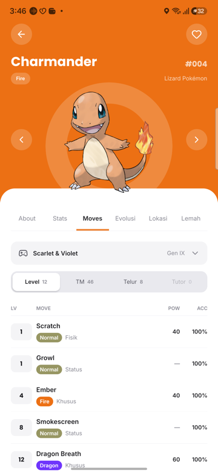 | 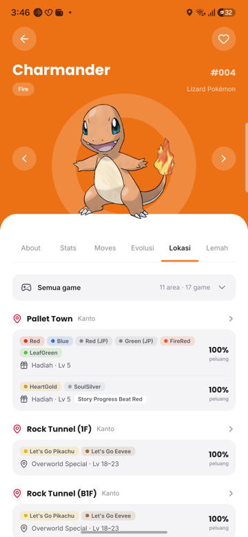 | 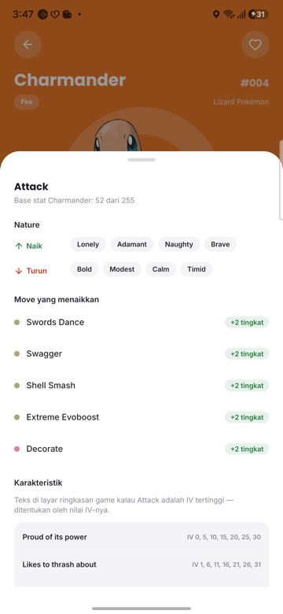 |  |

| Moves | Region · Kanto | Item | Pal Park |
|---|---|---|---|
| 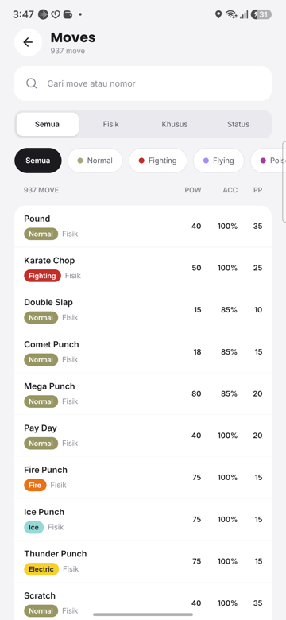 |  | 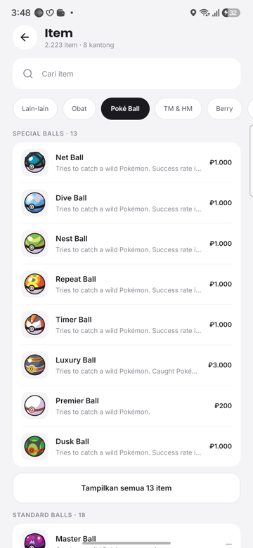 | 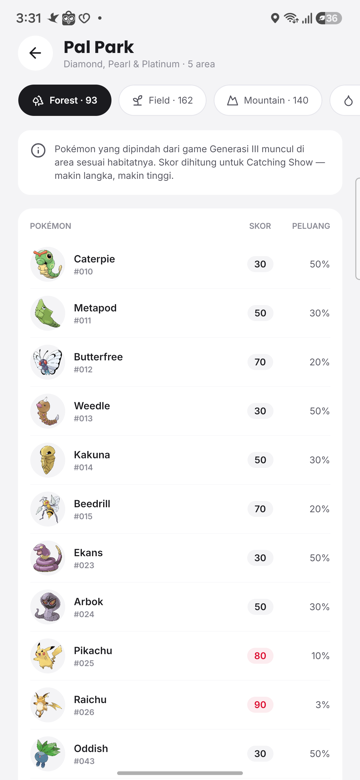 |

| Kelompok · Gender | Growth rate | Splash | Sheet bahasa data |
|---|---|---|---|
| 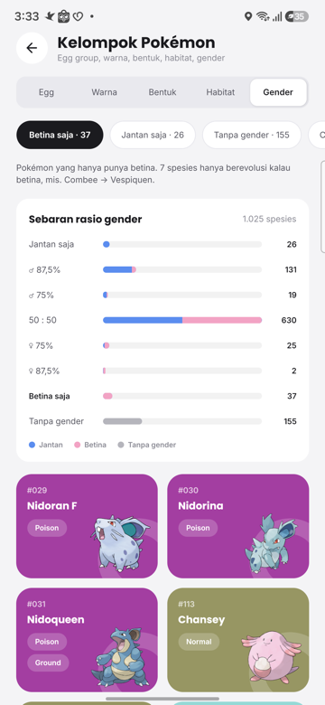 | 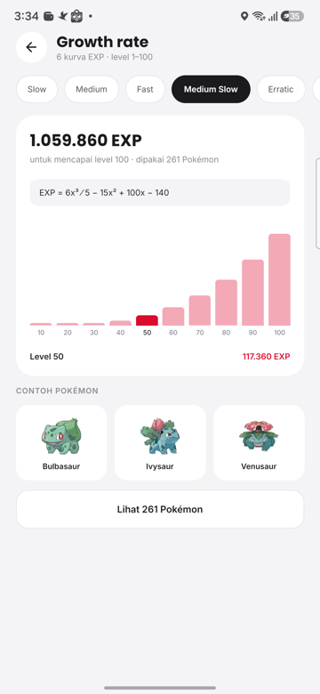 | 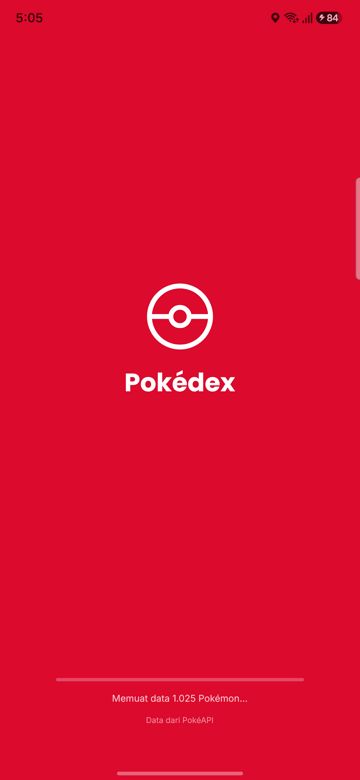 | 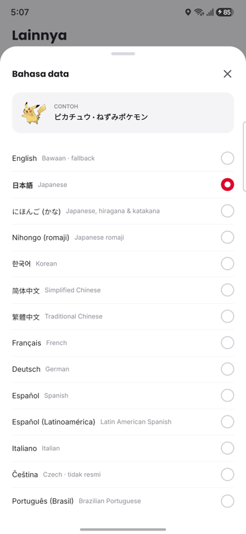 |

| Detail · bahasa Jepang | Detail move | Berry | Pokédex regional |
|---|---|---|---|
| 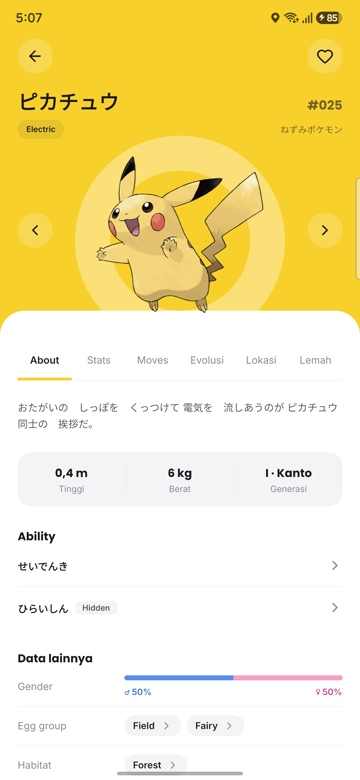 | 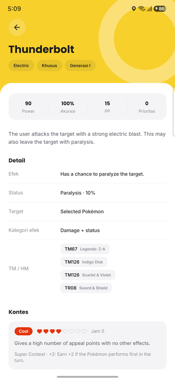 | 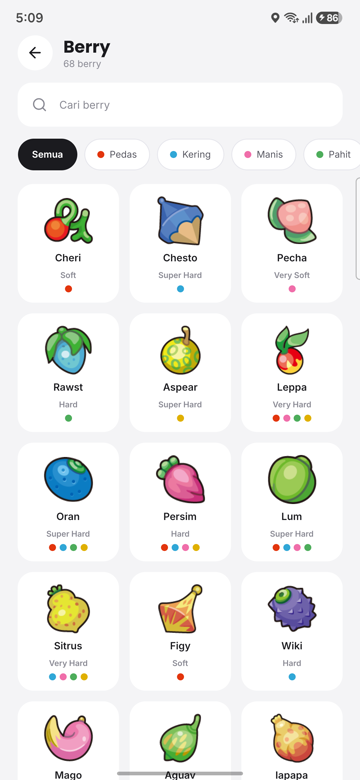 | 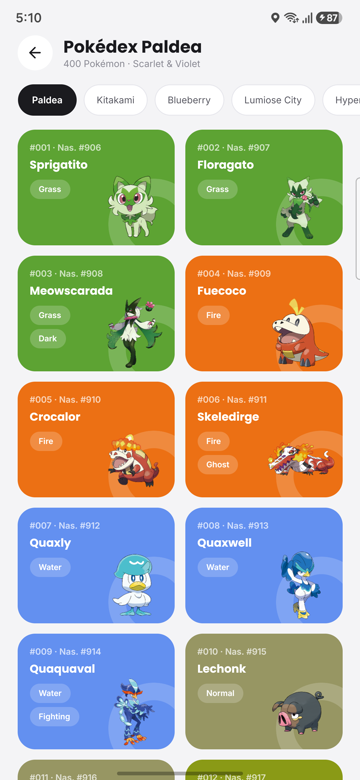 |

| Nature | Metode encounter |
|---|---|
| 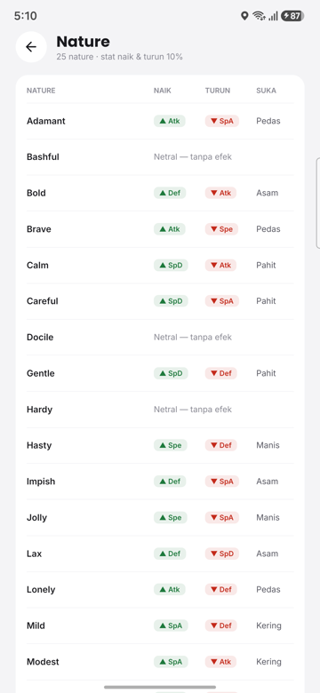 | 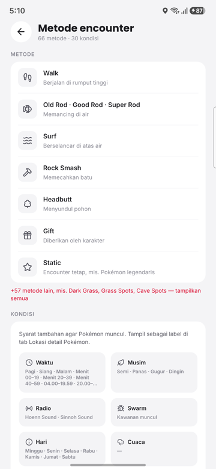 |

## Menjalankan project

### Prasyarat

- Node.js **≥ 22.11**
- Android: JDK 17 + Android SDK (lihat [panduan environment React Native](https://reactnative.dev/docs/set-up-your-environment))
- iOS (macOS): Xcode + CocoaPods (via Bundler)

### Langkah

```bash
cd pokedex-app
npm install                 # juga menerapkan patch di patches/ (postinstall)
cp .env.example .env        # API_BASE_URL=https://pokeapi.co/api/v2
```

iOS saja, sekali setelah install:

```bash
cd ios && bundle install && bundle exec pod install && cd ..
```

Jalankan:

```bash
npm start            # Metro
npm run android      # atau: npm run ios
```

Tidak perlu API key — PokéAPI publik.

### Perintah lain

| Perintah | Fungsi |
|---|---|
| `npm test` | Unit test (Jest) |
| `npm run typecheck` | `tsc --noEmit` |
| `npm run lint` | ESLint |
| `npm run android-d` | Build APK debug → otomatis disalin ke `pokedex-app/documentation/` |
| `npm run android-r` | Build APK release → disalin ke `pokedex-app/documentation/` (APK release di-commit, hanya versi terbaru) |
| `python3 documentation/regen-html.py` | Render `CHANGELOG.md` → `changelog.html` + perbarui tombol download APK di README ini |

## Struktur repo

```
.
├── BRIEF.md            # brief produk: lingkup, daftar layar, API per layar, prinsip desain
├── design/             # desain pen.dev (pokedex.pen) + artwork mockup
├── docs/screenshots/   # screenshot README
└── pokedex-app/        # aplikasi React Native
    ├── src/
    │   ├── components/   # atomic design: atoms / molecules / organisms (generik, tanpa fetch)
    │   ├── hooks/        # useRefresh, useTabBarInset, usePokemonTypes, …
    │   ├── navigation/   # ROUTES, param types, stack + tab navigator
    │   ├── screens/      # satu folder per route (+ sub-komponen khusus layar)
    │   ├── services/api/ # axios + RTK Query, satu file per domain PokéAPI
    │   ├── store/        # Redux store, redux-persist, favorites / settings / network slice
    │   ├── theme/        # token warna, tipografi, shadow (dari desain)
    │   ├── types/        # tipe response PokéAPI (subset field yang dipakai)
    │   └── utils/        # fungsi murni + __tests__
    ├── documentation/    # CHANGELOG (+ HTML), APK release terbaru (debug tidak di-commit)
    ├── patches/          # patch-package
    └── CLAUDE.md / PROJECT_CONVENTIONS.md   # konvensi kode
```

## Arsitektur

**Stack:** React Native 0.87 (New Architecture) · React 19 · TypeScript 6 · React Navigation 7 ·
Redux Toolkit 2 + RTK Query · redux-persist + AsyncStorage · Reanimated 4 · FastImage · Lucide icons.

```
Screen ──hook──▶ RTK Query endpoint (<domain>.service.ts) ──▶ axios ──▶ PokéAPI
   ▲                       │ transformResponse (buang field tak terpakai)
   │                       ▼
   └──── selector ◀── Redux store ──redux-persist──▶ AsyncStorage (favorit + cache API)
```

### Endpoint yang dipakai

**Ke-51 resource PokéAPI** dipakai di UI (sejak v0.2.0).

| Grup | Resource | Dipakai di |
|---|---|---|
| Pokémon | `pokemon`, `pokemon-form`, `pokemon-species`, `ability`, `type`, `stat`, `characteristic`, `nature`, `pokeathlon-stat`*, `egg-group`, `gender`, `growth-rate`, `pokemon-color`, `pokemon-shape`, `pokemon-habitat` | Pokédex, Detail, Tipe, Kelompok, Nature, Growth rate |
| Evolusi | `evolution-chain`, `evolution-trigger`, `evolution-variable` | Tab Evolusi, Pemicu evolusi |
| Moves | `move`, `move-ailment`*, `move-battle-style`*, `move-category`*, `move-damage-class`, `move-learn-method`*, `move-target`, `machine` | Moves, Detail move, tab Moves, Nature |
| Kontes | `contest-type`, `contest-effect`, `super-contest-effect` | Detail move, Berry, Kontes |
| Item | `item`, `item-attribute`, `item-category`, `item-fling-effect`, `item-pocket`, `currency` | Item, Detail item |
| Berry | `berry`, `berry-firmness`, `berry-flavor` | Berry, Kontes, Nature |
| Lokasi | `region`, `location`, `location-area`, `pal-park-area`, `encounter-method`, `encounter-condition`, `encounter-condition-value`* | Region, Lokasi, Pal Park, tab Lokasi, Metode encounter |
| Game | `generation`, `version`, `version-group`, `pokedex` | Filter generasi, Game, Pokédex regional, tab Moves |
| Utilitas | `language`, `meta` | Sheet Bahasa data (label *tidak resmi* dari `language.official`), baris Versi data PokéAPI di Lainnya |

\* Datanya dibaca dari response resource induk (mis. `nature.pokeathlon_stat_changes`,
`move.meta.ailment`, `pokemon.moves[].version_group_details`) — tanpa request terpisah.

Gambar: `official-artwork/{id}.png` (URL dibentuk dari id) dan sprite item `items/dream-world/{name}.png`
(fallback ke sprite default).

Detail lengkap per layar ada di [`BRIEF.md`](BRIEF.md).

## Keputusan teknis

- **Pencarian & filter lokal.** PokéAPI tidak punya endpoint search. Index 1.025 nama (±40 KB) diambil
  sekali, lalu cari / filter tipe / filter generasi / urut dijalankan di perangkat
  (`utils/pokedexFilter.ts`, ada unit test). Cari nomor dicocokkan persis (`25` → Pikachu, bukan #250–259);
  nama dinormalisasi (`Mr. Mime`, `Flabébé`, `Farfetch'd` tetap ketemu).
- **`limit=1025`, bukan `count` total.** `/pokemon` berisi 1.351 entri termasuk varian bentuk (id 10001+);
  dibatasi ke Pokédex nasional supaya konsisten di semua layar.
- **Tipe di kartu dimuat lazy & ringan.** Index tidak memuat tipe, jadi tiap kartu mengambil tipenya hanya
  saat dirender (FlatList me-mount item di sekitar viewport) lewat `/pokemon-form/{id}` — lihat [Performa](#performa).
  Kartu tampil netral + skeleton sampai tipenya datang, dan hasilnya di-cache.
- **RTK Query** menangani cache, deduplikasi request, status loading/error, dan refetch. Setiap domain
  mendaftarkan endpoint sendiri (`injectEndpoints`).
- **Cache dipersist ke disk** (sesuai fair-use policy PokéAPI yang mewajibkan cache). Karena response
  `/pokemon/{id}` memuat ratusan `moves`, `transformResponse` hanya menyimpan field yang dipakai —
  cache ratusan Pokémon tetap di bawah 1 MB.
- **Warna kartu sistematis dan terbaca.** 18 warna tipe resmi digelapkan seperlunya agar teks putih
  mencapai kontras ≥ 3:1; tipe terang (Electric, Ice, Ground, Steel) memakai teks gelap
  (`theme/colors.ts → typePalette`).
- **Tab bar custom melayang.** Bawaan library tidak bisa berbentuk kapsul melayang; konten setiap layar
  diberi ruang bawah (`useTabBarInset`) supaya item terakhir tidak tertutup.
- **Bar stat berskala 0–255** (nilai base stat maksimum di game), bukan relatif terhadap stat tertinggi
  Pokémon itu — supaya bar antar-Pokémon bisa dibandingkan.
- **Daftar besar dari index lokal (v2).** Move (937), item (2.223), dan lokasi (1.104) diambil sebagai
  index nama sekali (`resource.service.ts`), lalu dicari & dipaginasi di perangkat; detail tiap baris
  dimuat lazy saat baris dirender — pola yang sama dengan grid Pokédex.
- **Teks mengikuti bahasa data.** Nama & deskripsi diambil dari `names[]` / `flavor_text_entries[]`
  lewat `pickName` / `pickEntry` (fallback Inggris, lalu slug). Cache hanya menyimpan 14 bahasa yang
  didukung, satu entri terbaru per bahasa, jadi ganti bahasa di *Lainnya → Bahasa data* langsung berlaku
  tanpa unduh ulang. Efek ability lengkap hanya ada dalam en/de/fr; bahasa lain memakai teks game
  (`flavor_text_entries`), lalu jatuh ke Inggris dengan keterangan (`utils/ability.ts`).
- **Cache punya versi.** Kalau bentuk data hasil `transformResponse` berubah (v0.2.0 menambah field untuk
  layar baru), `version` redux-persist dinaikkan dan migrasinya membuang cache API lama — favorit &
  pengaturan tetap. Tanpa itu pengguna yang upgrade akan membaca data lama yang kekurangan field.
- **Data PokéAPI tidak selalu lengkap.** Tipe di `types/` mengikuti field yang bisa `null` (dipindai ke
  semua resource kecil + sampel resource besar), mis. berry generasi baru (Kee, Hopo, Roseli) tanpa data
  tanam, nature netral tanpa stat, region spin-off tanpa generasi. Nama Pokémon dari slug bentuk bawaan
  (`deoxys-normal`, `nidoran-f`) dirapikan lewat `pokemonName` tanpa request tambahan.
- **Urutan game kronologis.** Id grup versi PokéAPI tidak kronologis (Red & Green JP ditambahkan
  belakangan), jadi chip game, pemilih versi di tab Moves, dan tab Lokasi diurutkan dengan tabel rilis
  (`utils/labels.ts`, ada unit test).
- **Rumus growth rate** dari PokéAPI berupa LaTeX; diubah ke teks biasa (pecahan, pangkat, lantai,
  rumus bertingkat Erratic/Fluctuating) di `utils/formula.ts`.
- **Patch FastImage.** Definisi tipe `@d11/react-native-fast-image` merujuk tipe yang sudah dihapus di
  RN 0.87; diperbaiki lewat `patch-package` (hanya file `.d.ts`).

## Performa

Grid Pokédex bisa berisi ratusan kartu bergambar. Yang dilakukan supaya scroll tidak patah-patah:

- **Payload tipe 10× lebih kecil.** Tipe kartu diambil dari `/pokemon-form/{id}` (±27 KB untuk Pikachu)
  alih-alih `/pokemon/{id}` (±300 KB, berisi ratusan `moves`). Parse JSON besar terjadi di thread JS dan
  itulah sumber jank terbesar saat menggulir. Id form default = id Pokémon untuk #1–#1025 (diverifikasi
  pada 50 sampel termasuk Unown, Wormadam, Arceus, Zygarde, Ogerpon).
- **Gambar** lewat FastImage (Glide di Android / SDWebImage di iOS): cache memori + disk, dan di Android
  di-downsample otomatis ke ukuran tampil (84 px) — tidak men-decode 475 px penuh.
- **FlatList dituning**: batch render kecil (`initialNumToRender`/`maxToRenderPerBatch` = 6,
  `windowSize` = 5), `removeClippedSubviews` di Android, item & callback di-`memo`.
- **Animasi muncul hanya sekali per kartu** — kartu yang di-mount ulang saat scroll balik tidak
  dianimasikan lagi; animasinya sendiri berjalan di UI thread (Reanimated).
- Halaman 20 kartu per batch dari index lokal (tanpa request tambahan untuk paginasi).

## Mode offline

| Kondisi | Perilaku |
|---|---|
| Offline, data pernah dibuka | Tampil dari cache disk (redux-persist) + gambar dari cache FastImage, ada penanda "Offline". |
| Offline, data belum pernah dibuka | State khusus dengan tombol *Coba lagi*; kartu tampil netral tanpa skeleton berputar. |
| Koneksi kembali | Penanda "Kembali online", query yang aktif diambil ulang otomatis (`refetchOnReconnect`). |
| Pull-to-refresh saat offline | Data lama tetap tampil (tidak diganti error). |

Dianggap offline kalau `@react-native-community/netinfo` melaporkan tidak terhubung / internet tidak
terjangkau, **atau** request PokéAPI terakhir gagal tanpa response (mis. Wi-Fi tanpa internet, DNS gagal) —
penanda hilang lagi begitu ada request yang berhasil. Gambar yang gagal dimuat saat offline dicoba ulang
otomatis setelah datanya berhasil dimuat.

## Ukuran APK

Build release dikecilkan tanpa mengurangi fitur:

- **R8 + `shrinkResources`** — buang kode Java/Kotlin & resource library yang tidak terpakai; keep rule
  untuk library yang memakai refleksi ada di `android/app/proguard-rules.pro` (react-native-config,
  FastImage/Glide, Reanimated, Worklets).
- **Hanya arsitektur HP asli** (`arm64-v8a`, `armeabi-v7a`) — x86/x86_64 hanya untuk emulator.
- **Native library dikompres** di dalam APK (`useLegacyPackaging`) — APK dibagikan sebagai file, jadi
  ukuran unduhan diutamakan.
- **Terjemahan library dibatasi** ke `en` + `in` (UI app sudah bahasa Indonesia).
- **Font di-subset** ke Latin + tanda baca/simbol yang dipakai (1,98 MB → 1,27 MB), tanpa glyph yang
  hilang (diverifikasi otomatis).

Hasil: **APK release v0.2.0 22,1 MB** (dua arsitektur ARM, satu `classes.dex` 3,8 MB, bundle JS 4,5 MB) —
sebagai pembanding, APK debug tanpa optimasi ini 236,8 MB. Tab Jelajah dan 20+ layar v2 hanya menambah ±0,2 MB.

## Pengujian

- **Unit test (Jest)** — 57 test untuk logika murni: format satuan PokéAPI (dm → m, hg → kg), parsing
  URL, rasio gender, cari/filter/urut, efektivitas tipe (termasuk dual-type, mis. Bulbasaur ×¼ terhadap
  Grass), perataan pohon evolusi (termasuk cabang Eevee), deteksi PokéAPI tidak terjangkau, pemilihan
  bahasa data & fallback efek ability, nama Pokémon dari slug (`nidoran-f` → Nidoran♀), konversi rumus
  growth rate, label & urutan game / item / kondisi encounter, dan migrasi cache v1 → v2.

  ```bash
  cd pokedex-app && npm test
  ```

- **Manual di perangkat fisik** (Samsung Galaxy A54, Android 16): semua halaman, pencarian, filter
  gabungan (Gen I + Fire = 12), urutan, favorit, prev/next, sheet ability, pull-to-refresh, hapus cache,
  tab bar saat keyboard muncul, dan scroll sampai item terakhir. Layar v2 (build debug): Jelajah, Region
  → Kanto → Viridian Forest, Pal Park, Game, Pokédex regional (ganti Pokédex), Kelompok (Egg & Gender),
  Nature (baris dibuka), Growth rate (Medium Slow & Erratic), Kontes, Pemicu evolusi, Metode encounter,
  serta Detail Pokémon v2 (About, Stats + sheet, Moves, Lokasi) untuk Pikachu, Pichu, dan Charmander.
- **APK release (R8 aktif)** di perangkat yang sama: app terbuka tanpa crash, data PokéAPI & gambar
  termuat (konfigurasi `.env` tidak rusak oleh R8), favorit dari versi sebelumnya tetap ada,
  ikon adaptive Pikachu terpasang.
- **v0.2.0 — audit desain vs aplikasi**: ke-44 layar di `design/pokedex.pen` dicocokkan dengan aplikasi di
  perangkat (label teks diekstrak dari desain lalu dicari di kode, layar v2 dibandingkan visual satu per
  satu). Hasilnya diperbaiki: Splash (progress bar + kredit), kolom *Suka* di Nature, nomor regional +
  nasional di Pokédex regional, urutan kantong/kategori Item, label kondisi encounter, urutan lokasi
  Pokémon, kategori efek move, dan bagian *Efek saat dipegang* item. Ditemukan juga crash daftar Berry
  (data PokéAPI `null` untuk berry generasi baru) dan nama Pokémon dari slug bentuk bawaan.
- **v0.2.0 di APK release**: Splash tanpa kilasan warna (latar window Android = merah brand), ganti bahasa
  data (Jepang, Prancis, Ceko) di Lainnya → nama/kategori/deskripsi/ability di Detail ikut berubah,
  versi data PokéAPI, hapus cache, daftar Berry sampai akhir, dan layar v2 lainnya.
- **Kelancaran scroll** grid Pokédex (APK release, layar 120 Hz, `dumpsys gfxinfo`, fling naik-turun):

  | Kondisi | Frame janky | Median | p90 |
  |---|---|---|---|
  | Data tipe kartu sudah ter-cache | 10,7% | 11 ms | 21 ms |
  | Pertama kali (tipe kartu masih diunduh) | 33,0% | 19 ms | 32 ms |

- **Offline** (akses jaringan app diblokir lewat firewall Android): penanda *Offline · menampilkan data
  tersimpan* muncul, Home tetap menampilkan data cache, kartu yang belum tersimpan tampil netral, detail
  yang belum pernah dibuka menampilkan *Detail gagal dimuat*. Setelah jaringan kembali, *Coba lagi*
  memuat data **dan** artwork-nya, lalu muncul penanda *Kembali online*.

## Keterbatasan & langkah berikutnya

- Mode offline layar v2 belum diuji ulang di perangkat (pola error/cache-nya sama dengan v1).
- **iOS belum diuji di perangkat/simulator** — kode tidak memakai API khusus Android, tapi belum diverifikasi.
- Offline diuji dengan memblokir jaringan app (firewall Android), belum dengan mode pesawat sungguhan
  karena perangkat uji terhubung lewat ADB nirkabel.
- Scroll pertama kali masih lebih berat (33% frame janky) karena tipe kartu diunduh sambil menggulir;
  scroll berikutnya memakai cache.
- Nama di kartu grid tetap bahasa Inggris (dibentuk dari index tanpa request per kartu); nama dalam
  bahasa data tampil di halaman detail. Bahasa Čeština hampir tidak punya data di PokéAPI (*tidak resmi*).
- Suara Pokémon (`cries`) tidak ditampilkan — formatnya `.ogg`, tidak didukung native di iOS.
- GraphQL PokéAPI masih beta dan tidak stabil saat dicek, jadi app memakai REST.
- Belum ada test komponen / end-to-end (mis. React Native Testing Library, Maestro).
- Build release masih ditandatangani dengan debug keystore bawaan template.

## Kredit

- Data & artwork: [PokéAPI](https://pokeapi.co) dan [PokeAPI/sprites](https://github.com/PokeAPI/sprites).
- Font: [Poppins](https://fonts.google.com/specimen/Poppins) dan [Inter](https://rsms.me/inter/) — SIL Open Font License (lisensi ada di `pokedex-app/src/assets/fonts/`).
- Ikon: [Lucide](https://lucide.dev).

Pokémon dan nama karakternya adalah merek dagang Nintendo, Creatures Inc., dan GAME FREAK inc.
Project ini dibuat untuk keperluan tes dan tidak berafiliasi dengan mereka.
