# Pokédex — Mobile Take-Home Test

Aplikasi Pokédex React Native (Android & iOS) yang mengambil data dari [PokéAPI](https://pokeapi.co/docs/v2).
Jelajahi 1.025 Pokémon nasional, cari berdasarkan nama atau nomor, saring per tipe dan generasi,
pelajari stat, evolusi, dan kelemahannya, lalu simpan favorit — tetap bisa dibuka saat offline.

<!-- apk-download -->
<a href="https://github.com/riantosm/pokedex-app/raw/main/pokedex-app/documentation/PokedexApp-v0.1.0%281%29-release.apk"></a>
<!-- /apk-download -->

APK Android (arm64-v8a & armeabi-v7a, Android 7.0+) — unduh, lalu izinkan *Instal aplikasi tidak dikenal*
saat diminta. File-nya juga ada di [`pokedex-app/documentation/`](pokedex-app/documentation/).

<p>
  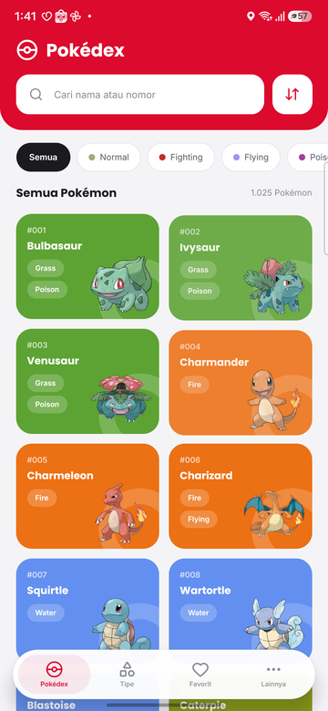
  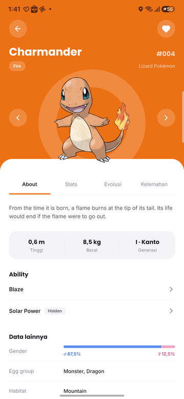
  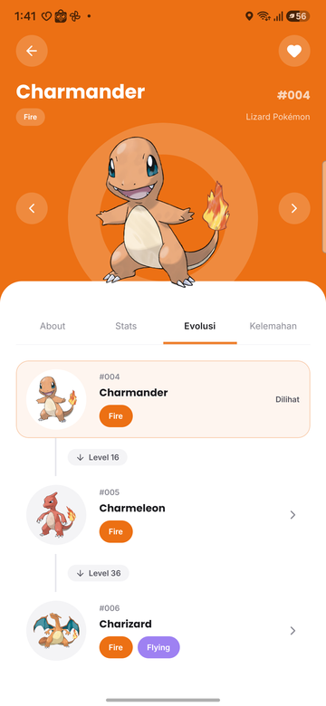
  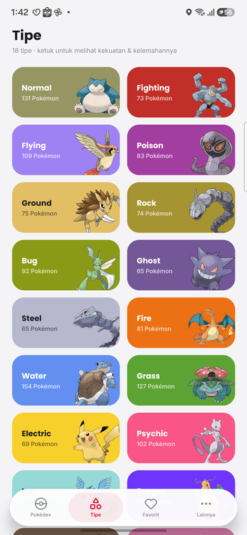
</p>

---

## Daftar isi

- [Fitur](#fitur)
- [Screenshot](#screenshot)
- [Menjalankan project](#menjalankan-project)
- [Struktur repo](#struktur-repo)
- [Arsitektur](#arsitektur)
- [Keputusan teknis](#keputusan-teknis)
- [Performa](#performa)
- [Mode offline](#mode-offline)
- [Ukuran APK](#ukuran-apk)
- [Pengujian](#pengujian)
- [Keterbatasan & langkah berikutnya](#keterbatasan--langkah-berikutnya)
- [Kredit](#kredit)

## Fitur

| Halaman | Isi |
|---|---|
| **Pokédex** | Grid 1.025 Pokémon berwarna sesuai tipe, dimuat 20 per halaman saat digulir. Cari nama (sebagian) atau nomor (persis), chip filter 18 tipe, sheet urutkan (nomor / nama) + filter generasi I–IX. |
| **Detail Pokémon** | Hero berwarna tipe dengan parallax, tab **About** (deskripsi, tinggi/berat, ability, gender, egg group, habitat), **Stats** (6 base stat + total), **Evolusi** (rantai + syarat, bisa ditap), **Kelemahan** (×4 / ×2 / ×½ / ×¼ / ×0, termasuk dual-type). Tombol sebelum/berikutnya, favorit, sheet efek ability. |
| **Tipe** | 18 tipe dengan jumlah Pokémon dan artwork perwakilan. |
| **Detail Tipe** | Efektivitas saat menyerang & bertahan, lalu daftar Pokémon bertipe tersebut. |
| **Favorit** | Pokémon yang disimpan di perangkat; tersedia offline. |
| **Lainnya** | Ukuran data tersimpan, hapus cache, versi app, sumber data, disclaimer. |

Berlaku di semua halaman:

- **Pull-to-refresh** untuk memuat ulang data dari API.
- **State lengkap**: skeleton saat memuat, hasil kosong, error / offline dengan tombol coba lagi.
- **Animasi**: transisi halaman geser, kartu muncul saat digulir, isi tab memudar, top bar yang
  muncul saat hero tergulir, efek tekan pada semua elemen yang bisa ditap.
- **Tab bar melayang** yang tidak pernah menutupi konten terakhir dan otomatis tersembunyi saat keyboard muncul.
- **Mode offline**: penanda *Offline · menampilkan data tersimpan*, semua data yang pernah dibuka
  (disimpan ke disk 7 hari) dan gambarnya tetap tampil, lalu data dimuat ulang otomatis saat koneksi kembali.
- **Scroll mulus** meski grid penuh gambar (lihat [Performa](#performa)).
- **Ikon aplikasi Pikachu** (adaptive & themed icon Android 13+, set AppIcon iOS).

## Screenshot

Diambil dari perangkat fisik (Samsung Galaxy A54, Android 16), build debug.

| Pokédex | Cari "char" | Urutkan & filter | Detail · About |
|---|---|---|---|
|  | 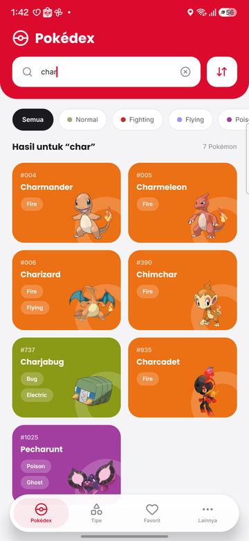 | 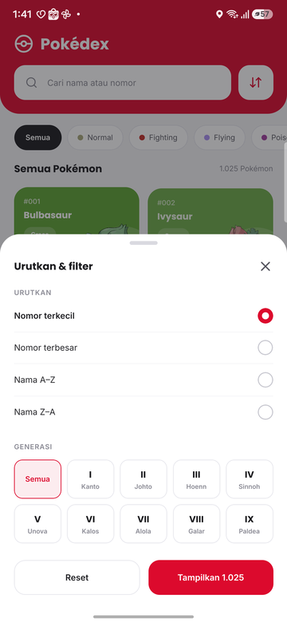 |  |

| Detail · Stats | Detail · Evolusi | Detail · Kelemahan | Sheet ability |
|---|---|---|---|
| 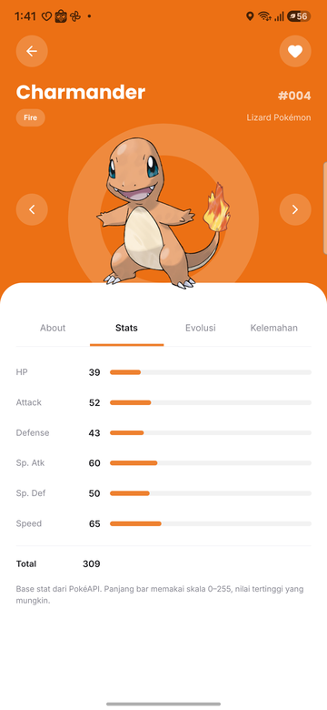 |  | 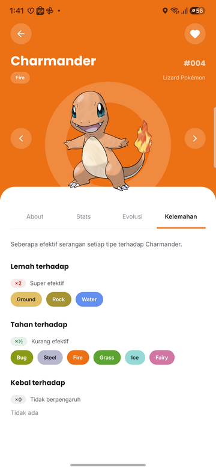 | 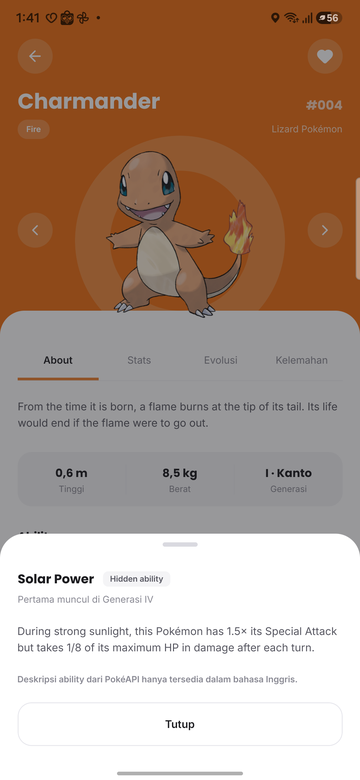 |

| Tipe | Detail tipe | Favorit | Lainnya |
|---|---|---|---|
|  | 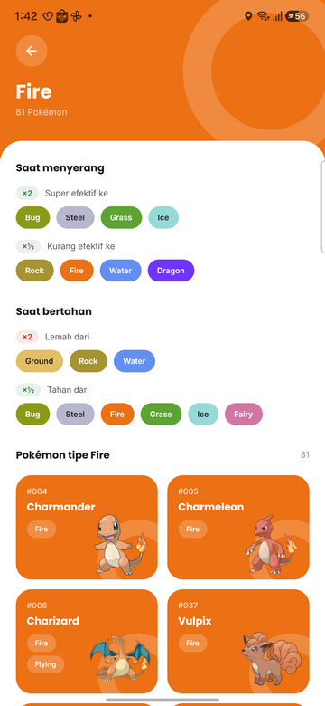 | 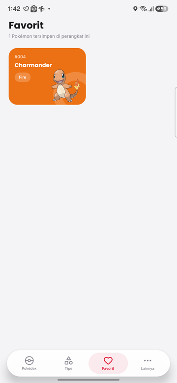 | 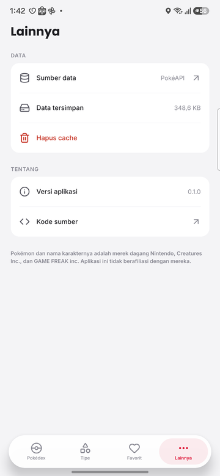 |

## Menjalankan project

### Prasyarat

- Node.js **≥ 22.11**
- Android: JDK 17 + Android SDK (lihat [panduan environment React Native](https://reactnative.dev/docs/set-up-your-environment))
- iOS (macOS): Xcode + CocoaPods (via Bundler)

### Langkah

```bash
cd pokedex-app
npm install                 # juga menerapkan patch di patches/ (postinstall)
cp .env.example .env        # API_BASE_URL=https://pokeapi.co/api/v2
```

iOS saja, sekali setelah install:

```bash
cd ios && bundle install && bundle exec pod install && cd ..
```

Jalankan:

```bash
npm start            # Metro
npm run android      # atau: npm run ios
```

Tidak perlu API key — PokéAPI publik.

### Perintah lain

| Perintah | Fungsi |
|---|---|
| `npm test` | Unit test (Jest) |
| `npm run typecheck` | `tsc --noEmit` |
| `npm run lint` | ESLint |
| `npm run android-d` | Build APK debug → otomatis disalin ke `pokedex-app/documentation/` |
| `npm run android-r` | Build APK release → disalin ke `pokedex-app/documentation/` (APK release di-commit, hanya versi terbaru) |
| `python3 documentation/regen-html.py` | Render `CHANGELOG.md` → `changelog.html` + perbarui tombol download APK di README ini |

## Struktur repo

```
.
├── BRIEF.md            # brief produk: lingkup, daftar layar, API per layar, prinsip desain
├── design/             # desain pen.dev (pokedex.pen) + artwork mockup
├── docs/screenshots/   # screenshot README
└── pokedex-app/        # aplikasi React Native
    ├── src/
    │   ├── components/   # atomic design: atoms / molecules / organisms (generik, tanpa fetch)
    │   ├── hooks/        # useRefresh, useTabBarInset, usePokemonTypes, …
    │   ├── navigation/   # ROUTES, param types, stack + tab navigator
    │   ├── screens/      # satu folder per route (+ sub-komponen khusus layar)
    │   ├── services/api/ # axios + RTK Query, satu file per domain PokéAPI
    │   ├── store/        # Redux store, redux-persist, favoritesSlice
    │   ├── theme/        # token warna, tipografi, shadow (dari desain)
    │   ├── types/        # tipe response PokéAPI (subset field yang dipakai)
    │   └── utils/        # fungsi murni + __tests__
    ├── documentation/    # CHANGELOG (+ HTML), APK hasil build (tidak di-commit)
    ├── patches/          # patch-package
    └── CLAUDE.md / PROJECT_CONVENTIONS.md   # konvensi kode
```

## Arsitektur

**Stack:** React Native 0.87 (New Architecture) · React 19 · TypeScript 6 · React Navigation 7 ·
Redux Toolkit 2 + RTK Query · redux-persist + AsyncStorage · Reanimated 4 · FastImage · Lucide icons.

```
Screen ──hook──▶ RTK Query endpoint (<domain>.service.ts) ──▶ axios ──▶ PokéAPI
   ▲                       │ transformResponse (buang field tak terpakai)
   │                       ▼
   └──── selector ◀── Redux store ──redux-persist──▶ AsyncStorage (favorit + cache API)
```

### Endpoint yang dipakai

| Endpoint | Dipakai di |
|---|---|
| `GET /pokemon?limit=1025` | Index untuk pencarian, filter, dan urut (sekali, di-cache) |
| `GET /pokemon/{id}` | About & Stats di detail, sinkron favorit |
| `GET /pokemon-form/{id}` | Tipe di kartu grid (lazy, payload ±10× lebih kecil) |
| `GET /pokemon-species/{id}` | Deskripsi, genus, gender, habitat, link evolusi |
| `GET /evolution-chain/{id}` | Tab Evolusi |
| `GET /type/{name}` | Filter tipe, Kelemahan, halaman Tipe & Detail Tipe |
| `GET /generation/{id}` | Filter generasi |
| `GET /ability/{name}` | Sheet ability |
| `official-artwork/{id}.png` | Semua gambar — URL dibentuk dari id, tanpa panggil detail |

Detail lengkap per layar ada di [`BRIEF.md`](BRIEF.md).

## Keputusan teknis

- **Pencarian & filter lokal.** PokéAPI tidak punya endpoint search. Index 1.025 nama (±40 KB) diambil
  sekali, lalu cari / filter tipe / filter generasi / urut dijalankan di perangkat
  (`utils/pokedexFilter.ts`, ada unit test). Cari nomor dicocokkan persis (`25` → Pikachu, bukan #250–259);
  nama dinormalisasi (`Mr. Mime`, `Flabébé`, `Farfetch'd` tetap ketemu).
- **`limit=1025`, bukan `count` total.** `/pokemon` berisi 1.351 entri termasuk varian bentuk (id 10001+);
  dibatasi ke Pokédex nasional supaya konsisten di semua layar.
- **Tipe di kartu dimuat lazy & ringan.** Index tidak memuat tipe, jadi tiap kartu mengambil tipenya hanya
  saat dirender (FlatList me-mount item di sekitar viewport) lewat `/pokemon-form/{id}` — lihat [Performa](#performa).
  Kartu tampil netral + skeleton sampai tipenya datang, dan hasilnya di-cache.
- **RTK Query** menangani cache, deduplikasi request, status loading/error, dan refetch. Setiap domain
  mendaftarkan endpoint sendiri (`injectEndpoints`).
- **Cache dipersist ke disk** (sesuai fair-use policy PokéAPI yang mewajibkan cache). Karena response
  `/pokemon/{id}` memuat ratusan `moves`, `transformResponse` hanya menyimpan field yang dipakai —
  cache ratusan Pokémon tetap di bawah 1 MB.
- **Warna kartu sistematis dan terbaca.** 18 warna tipe resmi digelapkan seperlunya agar teks putih
  mencapai kontras ≥ 3:1; tipe terang (Electric, Ice, Ground, Steel) memakai teks gelap
  (`theme/colors.ts → typePalette`).
- **Tab bar custom melayang.** Bawaan library tidak bisa berbentuk kapsul melayang; konten setiap layar
  diberi ruang bawah (`useTabBarInset`) supaya item terakhir tidak tertutup.
- **Bar stat berskala 0–255** (nilai base stat maksimum di game), bukan relatif terhadap stat tertinggi
  Pokémon itu — supaya bar antar-Pokémon bisa dibandingkan.
- **Patch FastImage.** Definisi tipe `@d11/react-native-fast-image` merujuk tipe yang sudah dihapus di
  RN 0.87; diperbaiki lewat `patch-package` (hanya file `.d.ts`).

## Performa

Grid Pokédex bisa berisi ratusan kartu bergambar. Yang dilakukan supaya scroll tidak patah-patah:

- **Payload tipe 10× lebih kecil.** Tipe kartu diambil dari `/pokemon-form/{id}` (±27 KB untuk Pikachu)
  alih-alih `/pokemon/{id}` (±300 KB, berisi ratusan `moves`). Parse JSON besar terjadi di thread JS dan
  itulah sumber jank terbesar saat menggulir. Id form default = id Pokémon untuk #1–#1025 (diverifikasi
  pada 50 sampel termasuk Unown, Wormadam, Arceus, Zygarde, Ogerpon).
- **Gambar** lewat FastImage (Glide di Android / SDWebImage di iOS): cache memori + disk, dan di Android
  di-downsample otomatis ke ukuran tampil (84 px) — tidak men-decode 475 px penuh.
- **FlatList dituning**: batch render kecil (`initialNumToRender`/`maxToRenderPerBatch` = 6,
  `windowSize` = 5), `removeClippedSubviews` di Android, item & callback di-`memo`.
- **Animasi muncul hanya sekali per kartu** — kartu yang di-mount ulang saat scroll balik tidak
  dianimasikan lagi; animasinya sendiri berjalan di UI thread (Reanimated).
- Halaman 20 kartu per batch dari index lokal (tanpa request tambahan untuk paginasi).

## Mode offline

| Kondisi | Perilaku |
|---|---|
| Offline, data pernah dibuka | Tampil dari cache disk (redux-persist) + gambar dari cache FastImage, ada penanda "Offline". |
| Offline, data belum pernah dibuka | State khusus dengan tombol *Coba lagi*; kartu tampil netral tanpa skeleton berputar. |
| Koneksi kembali | Penanda "Kembali online", query yang aktif diambil ulang otomatis (`refetchOnReconnect`). |
| Pull-to-refresh saat offline | Data lama tetap tampil (tidak diganti error). |

Deteksi memakai `@react-native-community/netinfo` — dianggap offline kalau tidak terhubung **atau**
terhubung tapi internet tidak terjangkau (mis. Wi-Fi tanpa internet).

## Ukuran APK

Build release dikecilkan tanpa mengurangi fitur:

- **R8 + `shrinkResources`** — buang kode Java/Kotlin & resource library yang tidak terpakai; keep rule
  untuk library yang memakai refleksi ada di `android/app/proguard-rules.pro` (react-native-config,
  FastImage/Glide, Reanimated, Worklets).
- **Hanya arsitektur HP asli** (`arm64-v8a`, `armeabi-v7a`) — x86/x86_64 hanya untuk emulator.
- **Native library dikompres** di dalam APK (`useLegacyPackaging`) — APK dibagikan sebagai file, jadi
  ukuran unduhan diutamakan.
- **Terjemahan library dibatasi** ke `en` + `in` (UI app sudah bahasa Indonesia).
- **Font di-subset** ke Latin + tanda baca/simbol yang dipakai (1,98 MB → 1,27 MB), tanpa glyph yang
  hilang (diverifikasi otomatis).

Hasil: **APK release 21,9 MB** (dua arsitektur ARM, satu `classes.dex` 3,7 MB) — sebagai pembanding,
APK debug tanpa optimasi ini 236,8 MB.

## Pengujian

- **Unit test (Jest)** — 26 test untuk logika murni: format satuan PokéAPI (dm → m, hg → kg), parsing
  URL, rasio gender, cari/filter/urut, efektivitas tipe (termasuk dual-type, mis. Bulbasaur ×¼ terhadap
  Grass), dan perataan pohon evolusi (termasuk cabang Eevee).

  ```bash
  cd pokedex-app && npm test
  ```

- **Manual di perangkat fisik** (Samsung Galaxy A54, Android 16): semua halaman, pencarian, filter
  gabungan (Gen I + Fire = 12), urutan, favorit, prev/next, sheet ability, pull-to-refresh, hapus cache,
  tab bar saat keyboard muncul, dan scroll sampai item terakhir.
- **APK release (R8 aktif)** di perangkat yang sama: app terbuka tanpa crash, data PokéAPI & gambar
  termuat (konfigurasi `.env` tidak rusak oleh R8), favorit dari versi sebelumnya tetap ada,
  ikon adaptive Pikachu terpasang.
- **Kelancaran scroll** grid Pokédex (APK release, layar 120 Hz, `dumpsys gfxinfo`, fling naik-turun):

  | Kondisi | Frame janky | Median | p90 |
  |---|---|---|---|
  | Data tipe kartu sudah ter-cache | 10,7% | 11 ms | 21 ms |
  | Pertama kali (tipe kartu masih diunduh) | 33,0% | 19 ms | 32 ms |

- **Offline** (akses jaringan app diblokir lewat firewall Android): Home tetap menampilkan data cache;
  detail yang belum pernah dibuka menampilkan state *Detail gagal dimuat*, dan *Coba lagi* memulihkannya
  setelah jaringan kembali.

## Keterbatasan & langkah berikutnya

- **iOS belum diuji di perangkat/simulator** — kode tidak memakai API khusus Android, tapi belum diverifikasi.
- Penanda *Offline* mengikuti status koneksi sistem (NetInfo); belum diuji dengan mode pesawat
  sungguhan karena perangkat uji terhubung lewat ADB nirkabel.
- Scroll pertama kali masih lebih berat (33% frame janky) karena tipe kartu diunduh sambil menggulir;
  scroll berikutnya memakai cache.
- Deskripsi Pokémon & efek ability hanya tersedia dalam bahasa Inggris dari PokéAPI.
- Suara Pokémon (`cries`) tidak ditampilkan — formatnya `.ogg`, tidak didukung native di iOS.
- GraphQL PokéAPI masih beta dan tidak stabil saat dicek, jadi app memakai REST.
- Belum ada test komponen / end-to-end (mis. React Native Testing Library, Maestro).
- Build release masih ditandatangani dengan debug keystore bawaan template.

## Kredit

- Data & artwork: [PokéAPI](https://pokeapi.co) dan [PokeAPI/sprites](https://github.com/PokeAPI/sprites).
- Font: [Poppins](https://fonts.google.com/specimen/Poppins) dan [Inter](https://rsms.me/inter/) — SIL Open Font License (lisensi ada di `pokedex-app/src/assets/fonts/`).
- Ikon: [Lucide](https://lucide.dev).

Pokémon dan nama karakternya adalah merek dagang Nintendo, Creatures Inc., dan GAME FREAK inc.
Project ini dibuat untuk keperluan tes dan tidak berafiliasi dengan mereka.
